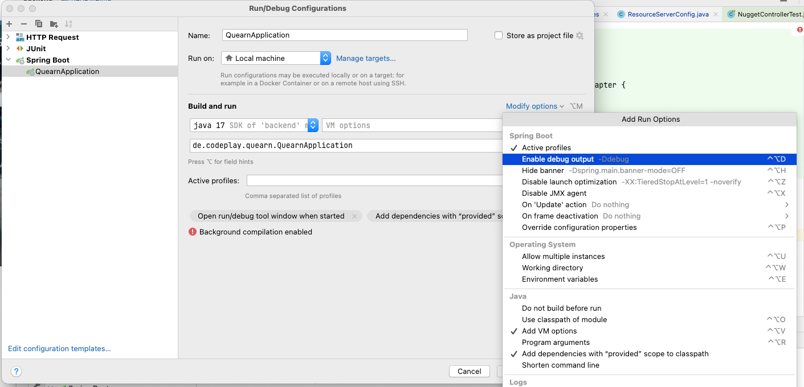

# Intellij 

## Http-Client
### View "Endpoints" 
right tab "HTTP Client" -> "open in Editor"

### Examples for getting Keycloak tokens:
```
### Authorization by token, part 1. Retrieve and save token.
POST http://localhost:8180/auth/realms/bodo/protocol/openid-connect/token
Content-Type: application/x-www-form-urlencoded

grant_type=password&client_id=login-app&username=user1&password=geheim

> 

### Authorization by token, part 2. Use refresh_token to get new access_token.
POST http://localhost:8180/auth/realms/bodo/protocol/openid-connect/token
Content-Type: application/x-www-form-urlencoded

grant_type=refresh_token&client_id=login-app&username=user1&refresh_token={{refresh_token}}

> 


```

### other examples:
```
### changing debug level
POST http://localhost:8080/actuator/loggers/ROOT
Content-Type: application/json

{
  "configuredLevel": "DEBUG"
}

### changing debug level
POST http://localhost:8080/actuator/loggers/org.apache.http.wire
Content-Type: application/json

{
  "configuredLevel": "INFO"
}

```

## DEBUG Log output
* in Intellij, to force spring debug logging use : 
* or (even without Intellij), add `logging.level.root=INFO` to `src/test/resources/application.properties` or `src/main/resources/application.properties`
* open  *"View->Tools Windows->Service"* in Intellij
