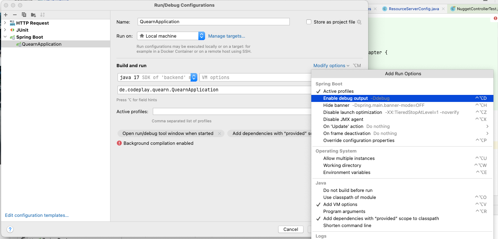

# Startup and Config
## Using CommandLineRunner
Spring Boot provides different mechanisms to run a specific code at [Application Startup.](https://medium.com/@cancerian0684/run-method-on-application-startup-in-spring-boot-37aa5e82c948)

Eine Möglichkeit ist der `CommandLineRunner`:

CommandLineRunner can be used to run code at application startup, provided it should be contained within SpringApplication.
```Java
@SpringBootApplication
public class Application {
   private static final Logger log = LoggerFactory.getLogger(Application.class);

   public static void main(String[] args) {
      SpringApplication.run(Application.class);
   }

   @Bean
   public CommandLineRunner demo(CustomerRepository repository) {
      return (args) -> {
         // save a couple of customers
      };
   }
}
```
wobei `(args) ->` hier die `args` von `main(args)` sind
## Configuration Klassen
`@Configuration` kann man jeder Klasse geben, damit es von SpringBoot beim Startup gescannt wird. 
Da `@Configuration` auch `@Component` einschließt , kann letzteres auch funktionieren, insb. wenn dessen Methoden auch noch mit `@Bean` markiert sind, muss aber nicht.
# Logging
private static final Logger LOGGER = LoggerFactory.getLogger(MyCurrentClass.class)

## H2-Database console access:
* [http://localhost:9090/h2-console/](http://localhost:9090/h2-console/) 
* user/password: see [src/main/resources/application.properties](src/main/resources/application.properties)
* add `http.headers().frameOptions().disable()`;

```java
@Configuration
@EnableWebSecurity
@EnableGlobalMethodSecurity(jsr250Enabled = true)
@EnableConfigurationProperties(KeycloakSpringBootProperties.class)
public class ResourceServerConfig extends KeycloakWebSecurityConfigurerAdapter {
    @Override
    protected void configure(HttpSecurity http) throws Exception {
        super.configure(http);
        http.authorizeRequests().anyRequest().permitAll();
        http.csrf().disable();
        http.headers().frameOptions().disable();//just for /h2-console
    }
//....
```

## DEBUG Log output
* in Intellij, to force spring debug logging use : 
* or (even without Intellij), add `logging.level.root=INFO` to `src/test/resources/application.properties` or `src/main/resources/application.properties`
* open  *"View->Tools Windows->Service"* in Intellij

## debug WebMCV oder webmvc tests
### Debug log for webmvc rest calls:
add  to `src/test/resources/application.properties` or `src/main/resources/application.properties`
```properties
logging.level.org.springframework.web.servlet.mvc.method.annotation.RequestMappingHandlerMapping=trace
logging.level.org.springframework.test.web.servlet.TestDispatcherServlet=trace
```

### Actuator Endpoints:
in `pom.xml` : add `<artifactId>spring-boot-starter-actuator</artifactId>`
```properties
#management.endpoints.enabled-by-default=true
management.endpoint.mappings.enabled=true
management.endpoints.web.exposure.include=info, health, mappings
```
call `http://localhost:9090/actuator/` oder direkt `http://localhost:9090/actuator/mappings` to show the REST (and other ) enpoints 


# Configuration
```java
@Configuration
@PropertySource(value = "classpath:build.properties", ignoreResourceNotFound = false)
```

## Weitere Annotations
### @Controller
**Spring MVC** , Spring Basis Componenten die auf built on the [Servlet API](https://javaee.github.io/servlet-spec/downloads/servlet-4.0/servlet-4_0_FINAL.pdf) (ein offizieller Java Standard ) aufsetzt und letztlich das "HttpServlet" abstrahiert, vor dem Entwickler verbirgt und damit leichter benutzbar macht.
Letztlich ersetzt die `@Controller` die Notwendigkeit sich mit dem  HttpServlet auseinandersetzten zu müssen.
Zum `@Controller` gehören weitere Annotations, die das ganze erst rund machen, z.B. :
* `@PostMapping("/meinpfad")`, ebenso `@GetMapping`, `@PutMapping`, `@DeleteMapping`, `@PatchMapping`, mit [7 möglichen Parametern](https://docs.spring.io/spring-framework/docs/current/javadoc-api/org/springframework/web/bind/annotation/PostMapping.html)
* `@RequestParam(required = false) `
### @RequestBody
Simply put, the `@RequestBody` annotation on a method argument inside a `@Controller` class maps the HttpRequest body to a transfer or domain object, enabling automatic deserialization of the inbound HttpRequest body onto a Java object. Der Text im "request body" wird dann als JSON oder XML angesehen und es wird versucht davon direkt ein entsprechendes Java- Objekt zu erzeugen und zu bestücken.
* optinal: `@RequestBody(required = true)`
### @ResponseBody
das Gegenstück zu `@RequestBody` nur für die Rückgabe des Ergebnisses 
### @RestController
`@RestController`’s source code shows that it actually is a `@Controller`, with the added `@ResponseBody` annotation. Which is equivalent to writing `@Controllers` which have `@ResponseBody` annotated on **every single method**.

## mit Lombok
### @RequiredArgsConstructor(onConstructor = @__(@Autowired))
ergänzt den `@RequiredArgsConstructor` um eine `@Autowired` Annotation
# Json Object Mapping
Passiert ja im RestController unter Umständen komplett implizit, daher [hier](https://attacomsian.com/blog/processing-json-spring-boot) nochmal zur Erinnerung , wie es explizit geht:
```java
//create ObjectMapper instance
        ObjectMapper objectMapper = new ObjectMapper();

        //read json file and convert to customer object
        Customer customer = objectMapper.readValue(new File("customer.json"), Customer.class);
``` 
## Api Documentation Sourcefile download Intellij/maven/gradle
- in Intellij - maven see https://stackoverflow.com/a/36071308/3952407
- gradle: add `plugins{ id 'idea' }` and 
```groovy   
idea {
    module {
        downloadJavadoc = true
    }
}
```

## spring-integration-smb
pom.xml:
```xml
<dependency>
            <groupId>org.springframework.integration</groupId>
            <artifactId>spring-integration-smb</artifactId>
            <version>6.0.4</version>
        </dependency>
```


```java
 void integrationSpringtest() throws IOException {
        var ssf = new SmbSessionFactory(); 
        ssf.setHost(host);
        // ssf.setHost(transfer);
        ssf.setUsername(host + "\\" + username);
        ssf.setPassword(password);
        ssf.setShareAndDir("/SHAREName/mydir/"); 
        var session = ssf.getSession();

        var files = session.list(".");
        for (var file : files) {
            log.info("CanonicalPath {}", file.getCanonicalPath());
        }

        log.info("test.csv {}",session.isFile("test.csv"));

        ByteArrayOutputStream outputStream = new ByteArrayOutputStream();
        session.read("test.csv",outputStream);
        byte[] fileContents = outputStream.toByteArray();
        outputStream.close();
        session.close();
        log.info("File content: " + new String(fileContents));
    }
```

